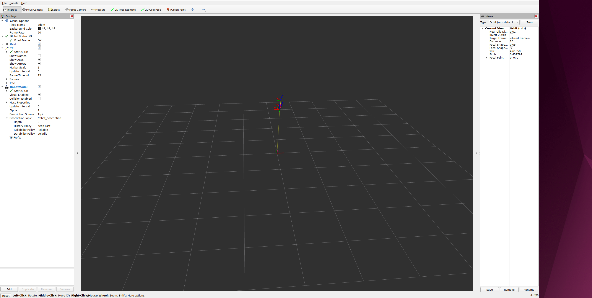
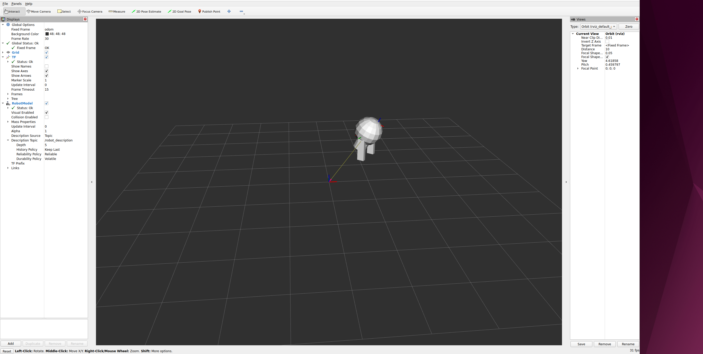

Reproduction steps：
１．Run IceOryx client (terminal 1)
```
cd ros2-urdf-tutorial
```
2.launch demo (terminal 2)
```
cd ros2-urdf-tutorial
CYCLONEDDS_URI=file://$PWD/cyclonedds.xml  ros2 launch urdf_tutorial demo.launch.py
```
3.launch rviz (terminal 3)
```
cd ros2-urdf-tutorial
CYCLONEDDS_URI=file://$PWD/cyclonedds.xml  ros2 launch urdf_tutorial rviz.launch.py
```

Under above execution steps, the robot model cannot be displayed normally on rviz.



If step 3 and 2 in reverse order (start rviz first), the robot model can be displayed normally on rviz.

